# UML - Diagrama y Resumen

Este archivo contiene un diagrama PlantUML (texto) que muestra las herencias principales del proyecto y un resumen de relaciones relevantes. Podés copiar el bloque PlantUML a https://plantuml.com/ o usar la extensión de PlantUML para generar una imagen.

## PlantUML

```plantuml
@startuml
' Model classes with attributes and methods (visibility: + public, - private, # protected)

class DatosPersonales {
	- static const unsigned int CORREO_SIZE
	- static const unsigned int DIRECCION_SIZE
	- static const unsigned int TELEFONO_SIZE
	- static const unsigned int CELULAR_SIZE
	- static const unsigned int ESTADO_SIZE
	- static const unsigned int CODIGORAZONSOCIAL_SIZE
	# bool alta
	# char correo[CORREO_SIZE]
	# char direccion[DIRECCION_SIZE]
	# char telefono[TELEFONO_SIZE]
	# char celular[CELULAR_SIZE]
	# char codigoRazonSocial[CODIGORAZONSOCIAL_SIZE]
	# DatosPersonales(bool _alta = false, ...)
	# bool IsEqual(const DatosPersonales& otro)
	# bool IsEmpty()
	+ ~DatosPersonales()
	+ bool getAlta()
	+ string Estado()
	+ string getCorreo()
	+ string getDireccion()
	+ string getTelefono()
	+ string getCelular()
	+ string getCodigoRazonSocial()
	+ static unsigned int GetCorreoSize()
	+ static unsigned int GetDireccionSize()
	+ static unsigned int GetTelefonoSize()
	+ static unsigned int GetCelularSize()
	+ static unsigned int GetEstadoSize()
	+ static unsigned int GetCodigoRazonSocialSize()
	+ void setAlta(bool a)
	+ void setCorreo(const string& correo)
	+ void setDireccion(const string& direccion)
	+ void setTelefono(const string& t)
	+ void setCelular(const string& c)
}

class Cliente {
	- static const unsigned int DNI_SIZE
	- static const unsigned int NOMBRE_SIZE
	- static const unsigned int APELLIDO_SIZE
	- static const unsigned int CUIL_CUIT_SIZE
	- char DNI[DNI_SIZE]
	- char nombre[NOMBRE_SIZE]
	- char apellido[APELLIDO_SIZE]
	- char cuilCuit[CUIL_CUIT_SIZE]
	+ Cliente(string _nombre = "", ...)
	+ ~Cliente()
	+ string getDNI()
	+ string getNombre()
	+ string getApellido()
	+ string getCuilCuit()
	+ static unsigned int GetDniSize()
	+ static unsigned int GetNombreSize()
	+ static unsigned int GetApellidoSize()
	+ static unsigned int GetCuilCuitSize()
	+ void setDNI(const string& dni)
	+ void setNombre(const string& n)
	+ void setApellido(const string& a)
	+ void setCuilCuit(const string& cuilCuit)
	+ bool operator==(Cliente& cliente)
	+ bool IsEmpty()
	+ void Print()
	+ static Cliente NuevoCliente()
	+ static void ModificarCliente(Cliente& cliente)
	+ static unsigned int EliminarCliente(Cliente& cliente)
}

class Proveedor {
	- inherits DatosPersonales (see class)
	+ // similar members as Cliente (defined in source headers)
}

class Producto {
	- static const unsigned int CODIGO_SIZE
	- static const unsigned int CODIGOPROVEEDOR_SIZE
	- static const unsigned int DESCRIPCION_SIZE
	- float precio
	- unsigned int stock
	- char codigo[CODIGO_SIZE]
	- char codigoProveedor[CODIGOPROVEEDOR_SIZE]
	- char descripcion[DESCRIPCION_SIZE]
	- void generarCodigoProducto(char* codigo)
	+ Producto(string _codigo = "", ...)
	+ ~Producto()
	+ string getCodigo()
	+ string getCodigoProveedor()
	+ string getDescripcion()
	+ float getPrecio()
	+ unsigned int getStock()
	+ void setDescripcion(string d)
	+ void setPrecio(float p)
	+ void setStock(unsigned int s)
	+ bool operator==(const Producto& otro)
	+ bool IsEmpty()
	+ void Print()
	+ static Producto NuevoProducto()
	+ static void ModificarProducto(Producto& producto)
	+ static unsigned int EliminarProducto(Producto& producto)
}

class Fecha {
	- int dia
	- int mes
	- int anio
	+ Fecha(int dia = 1, int mes = 1, int anio = 2024)
	+ int getDia()
	+ int getMes()
	+ int getAnio()
	+ void setDia(int d)
	+ void setMes(int m)
	+ void setAnio(int a)
	+ void CargarFecha()
	+ string toString()
	+ bool operator>(Fecha fechaComparar)
	+ bool operator>=(Fecha fechaComparar)
	+ bool operator<(Fecha fechaComparar)
	+ bool operator<=(Fecha fechaComparar)
	+ bool operator==(Fecha fechaComparar)
	+ bool operator!=(Fecha fechaComparar)
	+ static Fecha CrearFecha()
}

class TipoResponsable {
	- static const unsigned int CODIGO_SIZE
	- static const unsigned int DESCRIPCION_SIZE
	- char codigo[CODIGO_SIZE]
	- char descripcion[DESCRIPCION_SIZE]
	- float porcentaje
	- char tipoFacturacion
	+ TipoResponsable(const string _codigo = "", ...)
	+ ~TipoResponsable()
	+ string getCodigo() const
	+ string getDescripcion() const
	+ float getPorcentaje() const
	+ char getTipoFacturacion() const
	+ bool operator==(const TipoResponsable& otra) const
	+ bool IsEmpty() const
	+ void Print()
	+ static TipoResponsable NuevoTipoResponsable()
	+ static void ModificarTipoResponsable(TipoResponsable& tipo)
	+ static unsigned int EliminarTipoResponsable(TipoResponsable& tipo)
}

class Item {
	- static const unsigned int CODIGO_SIZE
	- char codigo[CODIGO_SIZE]
	- unsigned int cantidad
	- float precioUnitario
	+ Item(const char* _codigo = "", unsigned int _cantidad = 0, float _precioUnitario = 0.0f)
	+ ~Item()
	+ string getCodigo() const
	+ unsigned int getCantidad() const
	+ float getPrecioUnitario() const
	+ void setCodigo(const string& c)
	+ void setCantidad(unsigned int c)
	+ void setPrecioUnitario(float p)
	+ bool operator==(const Item& otro) const
	+ bool IsEmpty() const
	+ string toString() const
	+ static Item NuevoItem(class ProductoManager& pm)
	+ static void ModificarItem(Item& item, class ProductoManager& pm)
	+ static unsigned int EliminarItem(Item& item, class ProductoManager& pm)
}

class Comprobante {
	- static const unsigned int ITEMS_MAX
	- unsigned int numero
	- unsigned int itemsActuales
	- char clienteDNI[9]
	- Fecha fechaEmision
	- Item items[ITEMS_MAX]
	# float Total()
	# bool IsEqual(const Comprobante& otro)
	# bool IsEmpty()
	+ Comprobante(unsigned int _numero = 0, string _clienteDNI = "")
	+ ~Comprobante()
	+ unsigned int getNumero()
	+ string getClienteDNI()
	+ Fecha& getFechaEmision()
	+ void setClienteDNI(string dni)
	+ bool AgregarItem(const Item& it)
	+ bool EliminarItem(const string codigo)
	+ unsigned int CantidadItems()
	+ const Item* ObtenerItem(unsigned int index) const
	+ void LimpiarItems()
}

class Factura {
	- char cae[15]
	- Fecha vencimientoCAE
	- void ObtenerCAE()
	+ Factura(unsigned int _id = 0, string _cliente = "")
	+ ~Factura()
	+ string getCAE()
	+ Fecha getVencimientoCAE()
	+ float TotalSinIVA()
	+ bool Facturar()
	+ bool operator==(const Factura& otra)
	+ bool IsEmpty()
	+ void Print()
	+ static Factura NuevoFactura(unsigned int numero, class ProductoManager& pm)
	+ static void ModificarFactura(Factura& factura, class ProductoManager& pm)
	+ static unsigned int EliminarFactura(Factura& factura, class ProductoManager& pm)
}

class NotaDeCredito {
	- char motivoAnulacion[120]
	+ NotaDeCredito(unsigned int _id = 0, string _cliente = "", string _motivoAnulacion = "")
	+ ~NotaDeCredito()
	+ string getMotivoAnulacion()
	+ float TotalSinIVA()
	+ void setMotivoAnulacion(string m)
	+ bool operator==(NotaDeCredito& nota)
	+ bool IsEmpty()
	+ string toString()
	+ static NotaDeCredito NuevoNotaDeCredito(unsigned int numero, class ProductoManager& pm)
	+ static void ModificarNotaDeCredito(NotaDeCredito& nota, class ProductoManager& pm)
	+ static unsigned int EliminarNotaDeCredito(NotaDeCredito& nota, class ProductoManager& pm)
}

class FileSystem<T> {
	- const string filePath
	# bool Exist(T& record)
	+ FileSystem(const string& _filePath)
	+ ~FileSystem()
	+ unsigned int Count()
	+ bool IndexOf(T& record, unsigned int& index)
	+ T* operator[](unsigned int index)
	+ bool New(T& record)
	+ T* At(unsigned int index)
	+ bool Update(unsigned int index, T& record)
	+ bool Delete(unsigned int index)
	+ bool Backup(const string& backupFilePath)
	+ bool Restore(const string& backupFilePath)
}

FileSystem <|-- ClienteManager
FileSystem <|-- ProductoManager
FileSystem <|-- ProveedorManager
FileSystem <|-- TipoResponsableManager
FileSystem <|-- FacturaManager
FileSystem <|-- NotaDeCreditoManager

DatosPersonales <|-- Cliente
DatosPersonales <|-- Proveedor
Comprobante <|-- Factura
Comprobante <|-- NotaDeCredito
Factura "1" o-- "*" Item : contiene

@enduml
```



## Resumen de herencias y relaciones (texto)

- `DatosPersonales` <- `Cliente`, `Proveedor` (herencia)
- `Comprobante` <- `Factura`, `NotaDeCredito` (herencia)
- `Factura` contiene múltiples `Item` (composición lógica en la factura)
- `FileSystem<T>` : base / abstracción usada por managers (`ClienteManager`, `ProductoManager`, `ProveedorManager`, `TipoResponsableManager`, `FacturaManager`, `NotaDeCreditoManager`) para persistencia en archivos.
- `Menu` <- `MainMenu` y submenus específicos (`ClienteMenu`, `ProductoMenu`, `ProveedorMenu`, `VentaMenu`, `FacturaMenu`, `NotaDeCreditoMenu`, `TipoResponsableMenu`)
- `Modal` <- `Error`, `Informational`, `Warning` (modalidad de mensajes en consola)

## Notas

- El diagrama se centra en herencias y relaciones conceptuales. No se marcaron explícitamente composiciones/agregaciones con estereotipos visuales más allá de la relación `Factura` -> `Item` por claridad.
- Si querés, puedo generar una imagen PNG/SVG del diagrama PlantUML y agregarla al repo.

## Alternativa sin Java: Mermaid

- He incluido un diagrama en formato Mermaid en `diagrams/main.mmd`. Mermaid se puede previsualizar y exportar fácilmente desde el navegador en https://mermaid.live o usando `mmdc` (Mermaid CLI) si tenés Node.js instalado.

Ejemplo rápido para exportar (requiere Node.js):

```powershell
npm install -g @mermaid-js/mermaid-cli
mmdc -i diagrams/main.mmd -o diagrams/uml.png
```

Usar Mermaid es práctico cuando no se dispone de Java local y se quiere una imagen rápida para insertar en `README.md`.
